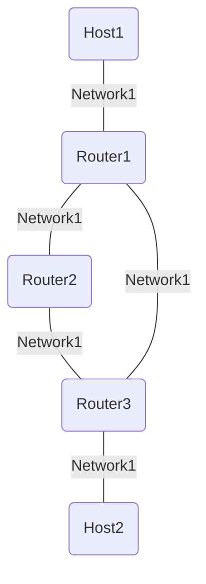

# 内容

rip というプロトコルを使用してルーター間のルーティングを冗長化したい

## 新しい用語

### スイート(Suite)

複数の関連する要素やコンポーネントが組み合わさってひとつのパッケージやセットとなっているやつ

## ネットワーク構成

- ルーター用コンテナを三つ作成し、ループ状になるように接続(router1~3)
- ホスト用コンテナを二つ用意する(host1,2)

## 操作内容

### router

- RIP デーモンというものが新しく必要になるので quagga というオープンソースをインストールする
- /etc/sysctl.conf の設定変更で ip パケットの転送を有効化
