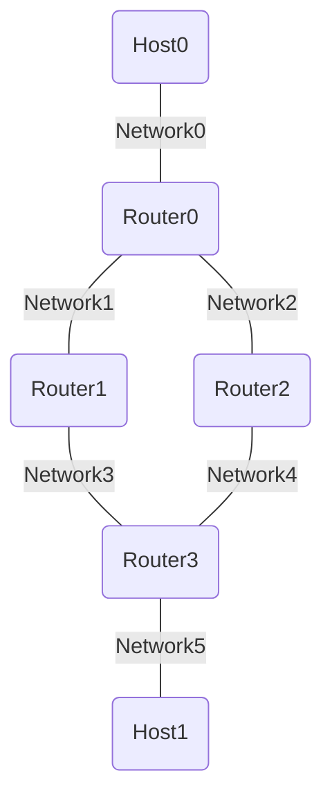

# 内容

RIP を使用してルーター間のルーティングを冗長化したい
出来ればバージョンごとに複数のネットワークを構築して、プロトコル上の課題も理解したい

## 新しい用語

### スイート(Suite)

複数の関連する要素やコンポーネントが組み合わさってひとつのパッケージやセットとなっているやつ

## ネットワーク構成

- ルーター用コンテナを三つ作成し、ループ状になるように接続(router1~3)
- ホスト用コンテナを二つ用意する(host1,2)

ip アドレスは以下の通り

- host0
  - Network0:
    - 10.0.0.10
- host1
  - Network5:
    - 10.0.5.10
- router0
  - Network0:
    - 10.0.0.2
  - Network1:
    - 10.0.1.2
  - Network2:
    - 10.0.2.2
- router1
  - Network1:
    - 10.0.1.3
  - Network3:
    - 10.0.3.2
- router2
  - Network2:
    - 10.0.2.3
  - Network4:
    - 10.0.4.2
- router3
  - Network3:
    - 10.0.3.3
  - Network4:
    - 10.0.4.3
  - Network5:
    - 10.0.5.2

## 設定内容

### router

RIP における必要な設定項目は以下の通り

- ネットワークアドレス
- RIP のバージョン
- ホスト名

#### ネットワークアドレス

ルーティングテーブルには、宛先のネットワークアドレスごとに次のホップが記載されている。
このため、宛先
